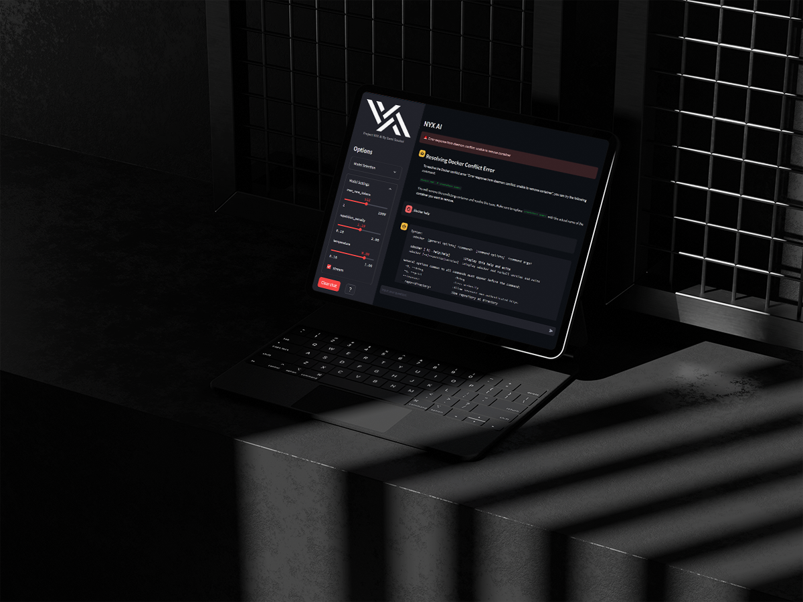

  

# Project NYX AI

## Description
Project NYX AI is a powerful prototype designed for ChatOps functionality, enabling the interpretation of natural language commands and their execution on the mainframe. This AI system serves as an invaluable assistant for DevOps engineers, providing helpful hints, explanations, and the ability to execute commands directly from the chat application.

  

## Features
1. **Natural Language Understanding:** NYX AI utilizes advanced natural language processing algorithms to interpret commands expressed in everyday language, ensuring a user-friendly experience for DevOps engineers.

2. **Command Execution:** The core functionality of NYX AI lies in its ability to execute commands directly on the mainframe. It streamlines operations such as deploying updates, managing resources, and running diagnostics through simple conversational interactions.

3. **DevOps Assistance:** NYX AI acts as a knowledgeable assistant, offering hints and detailed explanations for complex tasks. This feature enhances the learning experience, enabling users to make informed decisions and optimize their workflow.

4. **Chat Application Integration:** Seamless integration with popular chat applications allows DevOps teams to interact with NYX AI without switching between tools. This fosters collaboration and accelerates task resolution by keeping communication and execution in one unified environment.

5. **Security Measures:** Project NYX AI prioritizes security by implementing robust authentication mechanisms and access controls, ensuring that only authorized personnel can initiate critical commands and operations.

6. **Scalability:** Designed with scalability in mind, NYX AI can adapt to the evolving needs of DevOps teams, accommodating a growing set of commands, languages, and frameworks as the system matures.

## Usage
To initiate the NYX AI prototype, follow these steps:
1. Run `streamlit run app.py` in your terminal.
2. Access the chat interface through the provided URL.
3. Interact with NYX AI by entering natural language commands or using predefined scenarios.

## Scenarios
### Scenario 1 
#### Passive Mode (NYX Can Only assist the Devs)

If you encounter the Docker error 'Error response from daemon: conflict: unable to remove container', NYX AI can help you by providing a resolution command. Click the "Scenario 1" button to simulate this scenario.

### Scenario 2
#### Active Mode (NYX Interacts directly with the system to solve the issue when the devs are away)
Simulate a scenario where NYX AI assists in resolving an error related to moving logs. This scenario involves backing up logs, creating a backup directory, and executing a command to fix the issue. Click the "Scenario 2" button to trigger this simulation.

## Options
- **Clear Chat:** Use the "Clear Chat" button to clear the chat history.
- **❔ (Hint):** Click the "❔" button to receive helpful information and hints related to using NYX AI.

## Model Selection
- Choose from different language models using the "Model Selection" expander.
- Adjust settings such as `max_new_tokens`, `repetition_penalty`, `temperature`, and `stream` to customize the language model.

## Chat Input
- Input your questions or commands in the chat interface.
- Use commands like `/deploy` to execute specific operations.

## Note
Ensure that the required dependencies, such as `streamlit`, `ctransformers`, and `shell-genie`, are installed before running the application.

Feel free to explore and interact with Project NYX AI to leverage its capabilities for efficient ChatOps and DevOps tasks.